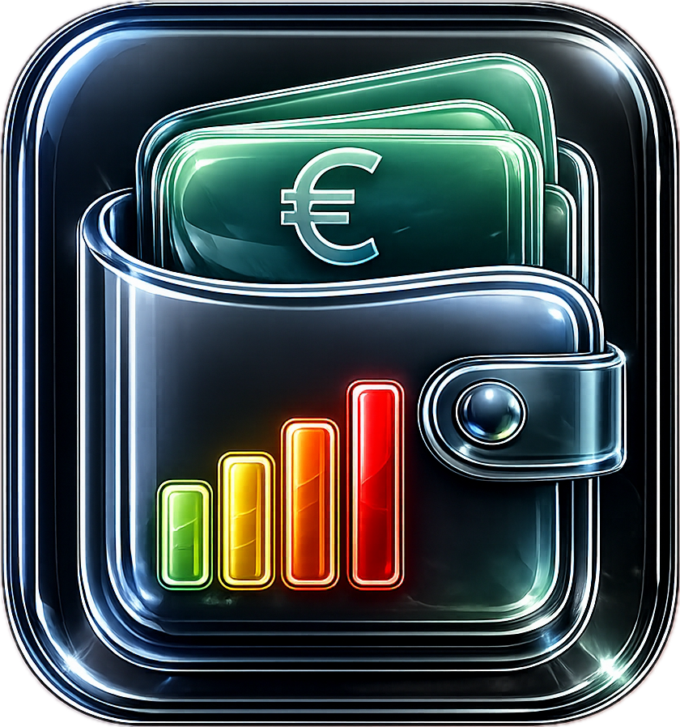

# 💶 BudgetApp

## 📱 Screenshots

<table>
  <tr>
    <td></td>
    <td></td>
  </tr>
  <tr>
    <td colspan="2" align="center">📋 Screenshots with sample data</td>
  </tr>
</table>

**Track your monthly income & expenses at a glance**

A Progressive Web App (PWA) for simple household budget management — runs directly in the browser, no installation needed, works offline.

🇩🇪 [Deutsche Version](README_de.md)

---

## ✨ Features

- 📊 **Dashboard** — Monthly balance, income & expenses at a glance
- 🍩 **Donut chart** — Visual breakdown of expense categories
- 📥 **Excel import** — Read `.xlsx` files directly (income & expenses are detected automatically, whitespace is normalised)
- 📤 **Excel export** — Export your budget as a `.xlsx` file
- 🖨️ **PDF export** — Print-ready export of your monthly overview
- ✏️ **Full editing** — Add, edit and delete entries inline
- 👆 **Swipe to delete** — Remove entries with a swipe gesture on mobile
- 🌗 **Dark / Light mode** — Toggle between dark and light theme (☀️ / 🌙)
- 🌐 **Language switch** — Switch between German and English at any time
- 💾 **Local storage** — All data stays exclusively on your device
- 📴 **Offline-ready** — Service Worker caches the app for use without internet
- 📱 **Installable** — Add to iPhone/iPad Home Screen or install as a desktop app

---

## 🔒 Privacy

**No data ever leaves your device.** The source code contains zero personal financial data. All entries are stored exclusively in the browser's local storage (localStorage) and are only visible on your device.

---

## 📱 Install as an App

**iPhone / iPad (Safari):**
1. Open `schrotty74.github.io/BudgetApp` in Safari
2. Tap the Share icon
3. Select „Add to Home Screen"
4. Tap „Add"

**Mac / Windows (Chrome or Edge):**
1. Open the page
2. Click the install icon in the address bar
3. Confirm „Install"

---

## 📥 Excel Import

The app automatically recognises `.xlsx` files as long as they contain sections labelled **Einnahmen** (Income) and **Ausgaben** (Expenses). Whitespace variations in section headers are handled automatically.

Supported frequencies: `Monatlich` · `Alle 2 Monate` · `Quartalsweise` · `Jährlich` · `Variabel`

---

## 🛠 Technology

- Pure HTML / CSS / JavaScript — no frameworks, no build step
- [SheetJS](https://sheetjs.com) for Excel import & export
- Service Worker for offline support
- localStorage for local data persistence

---

## 📄 License

GPL-3.0 — see [LICENSE](LICENSE)
